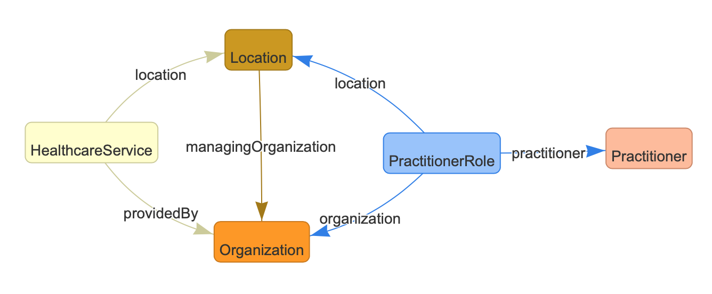

## Introduction to FHIR

The HL7® FHIR® (Fast Healthcare Interoperability Resources) standard defines how healthcare information can be exchanged between different systems. The FHIR standard defines data structures, termed 'resources' -- like Patient, Diagnostic Result, and Care Plan -- and how these resources can be exchanged using common Web protocols. 

FHIR describes both a REST API based on common requests/queries and more than 130 data structures. There are many resources for learning FHIR, and the basics are covered elsewhere. A hosted demo system can be used to increase your understanding of FHIR basics. 

!!! tip "FHIR Resource types are often capitalized to help identify them in text, e.g. Location, Organization, Practitioner, HealthcareService, and PractitionerRole."

Some great resources for learning are:

* The [HAPI FHIR Test Server](http://hapi.fhir.org/) The test server has a great web interface so you don't need to dig into a terminal to issues commmands. This is a great way to understand the REST API and the diverse types of resources.
* SmileCDR's [Intro to FHIR](https://www.youtube.com/watch?v=YbQcJj1GqH0&t=2175s). This is a video that explains the why and how of FHIR.

## Core FHIR Resources in mCSD

The below graphic shows the relevant FHIR resources for GOFR. 



Locations are the physical places where care occurs. Organizations are managing entities of HealthcareServices, Locations, PractitionerRoles, and of other resources.

The core FHIR resources provide a robust framework for linking patients with when, where, how, and why they receive care. For example, Healthcare Services resources possess `providedBy` and `location` references for the respective Organizations and Locations. A HealthcareService resource or Location can be queried using existing search methods to identify the services provided. OrganizationAffiliation is not depicted but can also be used in mCSD to describe a non-hierarchical relationship.

Practitioner and PractitionerRole are separate resources. As noted in the [FHIR R4 specification](https://www.hl7.org/fhir/practitionerrole.html#bnc):
>"Practitioner performs different roles within the same or even different organizations. Depending on jurisdiction and custom, it may be necessary to maintain a specific Practitioner Resource for each such role or have a single Practitioner with multiple roles. The role can be limited to a specific period, after which authorization for this role ends."

## Simple FHIR JSON Example

As a simple introduction, consider the following snippet from [here](https://www.hl7.org/fhir/location-examples-general.json.html). Here are the key takeaways:

* Its `resourceType` is bundle, meaning it can contain multiple resources, and of different types. This bundle is of type collection, meaning it just for reference.
* It has two entries, meaning individual resources, both of `resourceType` is location.
* The bundle has an `id`, but so does each location resource.
* `resource.partOf` links the two resources. Location/3 is part of Location/2. This is important. It nests the resources.

```json
{
  "resourceType": "Bundle",
  "id": "3ad0687e-f477-468c-afd5-fcc2bf897819",
  "type": "collection",
  "entry": [
    {
      "fullUrl": "http://hl7.org/fhir/Location/2",
      "resource": {
        "resourceType": "Location",
        "id": "2",
        "status": "active",
        "name": "USSS Enterprise-D",
        "mode": "instance"
      }
    },
    {
      "fullUrl": "http://hl7.org/fhir/Location/3",
      "resource": {
        "resourceType": "Location",
        "id": "3",
        "status": "active",
        "name": "USSS Enterprise-D Sickbay",
        "mode": "instance",
        "partOf": {
          "reference": "Location/2",
          "display": "USS Enterprise"
        }
      }
    }
  ]
}
```